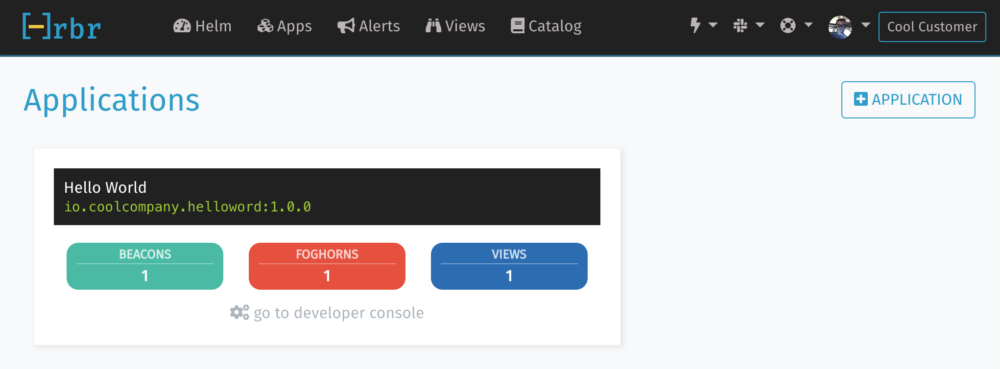

# Hrbr.io Hello World

If you were looking for the Hrbr.io __Hello World__, you've found it.

## Instructions

You will need to do a couple things before you can run the code.

### Create an Account

[Sign up](https://cloud.hrbr.io/) for your Hrbr.io account.  Signing up is free.

* Make a note of your API Key.

### Create an Application w/ a Beacon

While you are still on the site, go ahead and create an Application w/ a Beacon.  

1. Create your first Application and make note of the Application Id.  `appVersionId`'s 
use a naming convention similar to a lot of bundle/docker ids which is a combination of 
RDNS and semantic versioning. Example: *io.coolcompany.helloword:1.0.0*

2. Within that application, create your first Beacon and make note of the Beacon Id.  `beaconVersionId`'s 
use a naming convention similar to a lot of bundle/docker ids which is a combination of 
RDNS and semantic versioning. Example: *io.coolcompany.helloword:1.0.0*


### Working With the Sample Code

* Clone the repository.

```
$ git clone https://github.com/HrbrIO/HelloWorld.git
$ cd HelloWorld
```

* Install dependencies.
 
If you are using npm, run:

```$ npm update```

Or, if you are using yarn, run:

```$ yarn```

* Update the code.

Open `index.js` and replace __API_KEY__, __APP_VERSION_ID__, & __BEACON_VERSION_ID__  with the values
you entered while creating your Application & Beacon on https://cloud.hrbr.io

### Run the Sample Code

```$ node index.js```

If all is good, then you should see.

```
After our request
Success
1
```

### See Your Beacons 

To see the Beacons on Hrbr.io go to your [Applications](https://cloud.hrbr.io/#!/apps/list) and click
the link for your __developer console__.  



Once you have your console up and running, rerun the code from above to see your Beacons.

## Next Steps

You are on your way to full application observation using Hrbr.io.  If you are trying to figure out where to go next, 
try out the [Quick Start](https://docs.hrbr.io/quick-start-guide/) where you can add 
[Views](https://docs.hrbr.io/quick-start-guide/#add-a-view) or [Foghorns](https://docs.hrbr.io/quick-start-guide/#create-a-foghorn).   
